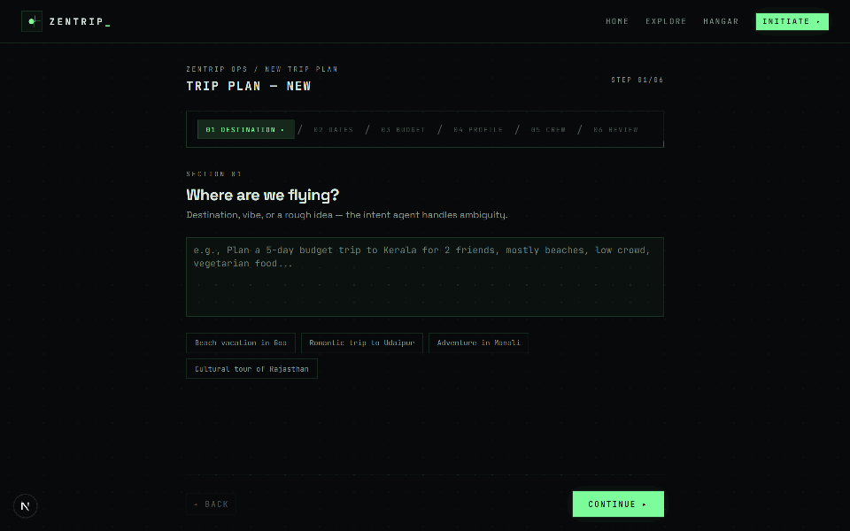

<div align="center">

# ✈️ ZENTRIP

### *Your AI Travel Ops Team — On Demand*

**Plan a real, bookable trip by describing it in one sentence. Ten... okay, *eight* specialist agents do the rest — live, in front of you.**

[](https://nextjs.org)
[](https://react.dev)
[](https://langchain-ai.github.io/langgraphjs/)
[](https://groq.com)
[](https://supabase.com)
[](https://typescriptlang.org)
[](https://tailwindcss.com)

</div>

<br />

<p align="center">
  
</p>
<p align="center">
  <sub><b>▲ Real capture, not a mock:</b> the 6-step filing wizard → DISPATCH → live agent telemetry streaming over SSE → PLAN LOCKED.<br/>Recorded headlessly against a real Groq-backed generation. <a href="scripts/capture-console.mjs">Capture script</a> included.</sub>
</p>

<br />

## 🤔 The Problem

Anyone who has planned a group trip knows the ritual: **40 open browser tabs**, a spreadsheet nobody updates, screenshots of hotels in three different group chats, and a budget argument at midnight.

Meanwhile, "AI trip planners" mostly hand you a hallucinated listicle — *"Visit the famous beach! Enjoy local cuisine!"* — with no dates, no budget logic, no weather awareness, and no way to actually edit the plan.

**ZenTrip is the answer to both problems.** It treats trip planning like a logistics operation, run by a crew of specialist AI agents that each do *one* job properly — parse what you meant, ground it in real geography, allocate real money, check the real sky — and then argue about the result with a QA agent before you ever see it.

<br />

## 💡 What It Does

Describe the trip the way you'd tell a friend:

> *"Plan a 5-day trip to Kerala for 2 friends — beaches, backwaters, low crowds, vegetarian food"*

Eight agents take it from there and hand you back a **complete, editable trip file**:

| | You get | Because |
|---|---|---|
| 📅 | **A day-by-day itinerary** with dated days, morning→night timelines, and every activity assigned exactly once | The planner schedules real activities between real meals |
| 🎪 | **Specific activities** — actual POIs with locations, durations, per-person costs, and indoor backups | A curation agent filters for real places, never "Beach walk" filler |
| 💰 | **A budget that adds up** — five envelopes (stay / food / activities / transport / buffer) enforced by deterministic math | An LLM *suggests*, but pure code allocates and clamps |
| 🌤️ | **Weather-aware scheduling** — rain-flagged activities get indoor alternatives or get moved | Live forecast data feeds both curation and planning |
| 🗺️ | **A route that makes geographic sense** — no backtracking, bounded daily travel time | Stops are clustered and validated against distance constraints |
| ⭐ | **A confidence score** and honest warnings — the supervisor *rejects weak plans* and forces one regeneration pass | You see the QA verdict, not just a happy output |

Then you take the wheel: **lock days**, **swap activities**, **regenerate single sections**, **collect group votes** from travel companions, **share a public link**, and **export to PDF / calendar / checklist**.

<br />

## 👥 The Crew — 8 Agents

The UI shows **8 agents** (AGT-01 → AGT-08). The graph actually runs **9 nodes** — the Intent agent's node also triggers the hidden **Place Resolver**, whose output merges silently into intent:

| # | Agent | Job | What makes it interesting |
|---|---|---|---|
| 🎯 | **INTENT** | Parses fuzzy human requests into structured preferences | Behind the scenes it also runs the **Place Resolver** (typo correction, country identification) — that's graph node #9 |
| 🌍 | **GROUNDING** | Anchors the trip to real geography + nearby places within a radius | *Never* overrides your chosen destination — only enriches it |
| 💰 | **BUDGET** | Splits your money into 5 envelopes | Ratios come from the deterministic constraint engine, not model vibes |
| 🗺️ | **ROUTE** | Sequences stops geographically | Bounded travel hours, no backtracking |
| 🌤️ | **WEATHER** | Live 5-day forecasts + rain advisories | Degrades to synthetic estimates, never blocks generation |
| 🎪 | **ACTIVITIES** | Curates real POIs | Balanced across categories, budget-capped, personalized to trip type/pace/food prefs |
| 📅 | **PLANNER** | Builds the final timeline | Assigns every activity exactly once, schedules meals + stays per day |
| ⭐ | **SUPERVISOR** | Strict QA gatekeeper | Checks destination integrity, budget fit, duplicates, category balance — can force a regeneration pass |

Not shown: 🧮 **Constraint Engine** — pure deterministic code (no LLM) that computes budget splits, radius limits, and daily caps. It runs between grounding and budget.

<br />

## 🖥️ The Console Aesthetic

ZenTrip's UI is a deliberate **terminal ops-console**: dark phosphor green (#7CFC9A), monospace telemetry, section codes (`AGT-01`, `SEC-01`), scan-line telemetry logs streaming in real time:

```text
╔══════════════════════════════════════════════════════════╗
║  AGT-01 INTENT ............. COMPLETE — Parsed: weekend   ║
║  AGT-02 GROUNDING .......... COMPLETE — Grounded: Kerala  ║
║  AGT-03 BUDGET ............. COMPLETE — ₹50,000 allocated ║
║  AGT-06 ACTIVITIES ......... ACTIVE  — Curating 15 ideas  ║
║  AGT-07 PLANNER ............ ▓▓▓▓▓▓░░░░  54%             ║
╚══════════════════════════════════════════════════════════╝
```

Not a dashboard. Not cards. A **cockpit** — because watching eight agents argue a plan into existence is half the product.

<br />

## ⚙️ How The Orchestration Works

```text
                    ┌─────────────────┐
                    │  USER REQUEST   │
                    └────────┬────────┘
                             ▼
   ┌──────────┐      ┌───────────────┐      ┌────────────────────┐
   │  INTENT  │─────▶│ PLACE RESOLVER │────▶│    GROUNDING       │
   └──────────┘      └───────────────┘      └─────────┬──────────┘
                                                      ▼
                                            ┌──────────────────┐
                                            │ CONSTRAINT ENGINE │  ← deterministic
                                            └────────┬─────────┘
                          ┌──────────────────────────┼──────────────────┐
                          ▼                          ▼                  ▼
                   ┌────────────┐            ┌────────────┐     ┌────────────┐
                   │   BUDGET   │            │   ROUTE    │     │   WEATHER  │
                   └─────┬──────┘            └─────┬──────┘     └─────┬──────┘
                         └────────────┬────────────┴──────────────────┘
                                      ▼
                             ┌─────────────────┐
                             │    ACTIVITIES   │
                             └────────┬────────┘
                                      ▼
                             ┌─────────────────┐
                             │     PLANNER     │
                             └────────┬────────┘
                                      ▼
                             ┌─────────────────┐
                             │   SUPERVISOR    │──── reject ──▶ regenerate (max 1 retry)
                             └────────┬────────┘
                                      ▼ approved
                                 ╔═════════╗
                                 ║  TRIP ✓ ║
                                 ╚═════════╝
```

**Implementation:** a `@langchain/langgraph` `StateGraph` in `src/lib/agents.ts` — typed state channels, a conditional retry edge, and every agent streaming progress events over **SSE** as it works.

**Reliability rules the pipeline lives by:**
- Every LLM call has a deterministic fallback — a single agent failing never kills a trip
- Bounded time everywhere: 90s per LLM call, 8s weather, 150s global cap
- The supervisor's retry counter persists correctly in graph state — no infinite regeneration loops
- Missing env keys produce clear errors, never silent zeros

<br />

## 🧭 The User Journey

```text
LANDING ──▶ NEW TRIP WIZARD ──▶ MISSION CONTROL ──▶ TRIP BOARD ──▶ SHARE / EXPORT
             (6-step filing)     (live agent feed)    (edit + votes)   (PDF · ICS · link)
```

1. **File the plan** — a 6-step wizard: destination idea → dates → budget → mission profile → crew → review. Each step validates progressively with Zod, so errors surface immediately, not at dispatch.
2. **Watch the crew work** — the wizard is replaced by Mission Control: eight agent panels with live progress bars and a timestamped telemetry log. Everything streams over one SSE connection. You can abort at any point.
3. **Take the wheel** — the trip board gives you the full dossier: day-by-day timeline, budget donut (Recharts), weather strip, route map (Leaflet). Lock days, remove/add activities — budget telemetry recalculates live.
4. **Get the crew's consensus** — under GROUP CONSENSUS, add companions, collect votes on trip type/pace/budget, and execute the merge. Locked days are never overwritten.
5. **Ship it** — create an expiring share link, export to print-optimized PDF, JSON, calendar, or a packing checklist.

<br />

## ✨ Feature Matrix

<table>
<tr>
<td width="50%" valign="top">

### 🎬 Generation Experience
- **SSE streaming** — per-agent progress events as the plan builds
- **Live telemetry log** — timestamped mission log in the console
- **Abortable** — cancel any in-flight generation via `AbortController`
- **6-step filing wizard** — destination → dates → budget → profile → crew → review
- **Progressive validation** — per-step Zod schemas, instant inline errors

</td>
<td width="50%" valign="top">

### 🧩 Trip Management
- **Interactive itinerary** — lock days, remove activities, add your own
- **Section regeneration** — regenerate just activities/budget/itinerary on demand
- **Group voting** — companions vote; most-frequent-vote preference merging
- **Share links** — slug-based public links with expiry + access levels
- **Exports** — PDF (print-optimized), JSON, calendar, packing checklist
- **Budget telemetry** — live recompute after every itinerary edit

</td>
</tr>
<tr>
<td width="50%" valign="top">

### 🛡️ Resilience Engineering
- **Graceful degradation everywhere** — every LLM call has a deterministic fallback via `safeGroqCall`; no single agent failure kills a trip
- **Bounded timeouts** — 90s per LLM call, 8s weather, 150s global orchestrator cap with proper timer cleanup
- **No infinite retries** — supervisor retry counter persists in graph state (max 1 regeneration pass)
- **Config-aware** — clear errors when Supabase/Groq keys are missing, never silent zeros

</td>
<td width="50%" valign="top">

### 🎨 UI System
- **shadcn/ui + Base UI** components on Tailwind v4
- **Framer Motion** page transitions + step animations
- **Zustand** store with persistence
- **Recharts** budget donut + trend charts
- **React Hook Form** + Zod progressive validation
- **Leaflet** maps integration
- **sonner** toasts, **lucide** icons

</td>
</tr>
</table>

<br />

## 🚀 Quickstart

```bash
# 1. Clone and install
git clone <your-repo-url> zentrip && cd zentrip
npm install

# 2. Configure environment
cp .env.local.example .env.local

# 3. Set up the database (see Database section below)

# 4. Launch the mission console
npm run dev
```

Open **http://localhost:3000** → complete the 6-step wizard → watch eight agents build your trip live.

> **No database yet?** Generation still works — persistence is the only thing that needs Supabase.

<br />

## 🔑 Environment Variables

| Variable | Required | Purpose |
|---|:---:|---|
| `GROQ_API_KEY` | ✅ | LLM inference — get one at [console.groq.com/keys](https://console.groq.com/keys) |
| `NEXT_PUBLIC_SUPABASE_URL` | 🔶 | Supabase project URL |
| `NEXT_PUBLIC_SUPABASE_ANON_KEY` | 🔶 | Client-side Supabase key |
| `SUPABASE_URL` | 🔶 | Server-side Supabase URL (falls back to public one) |
| `SUPABASE_SERVICE_ROLE_KEY` | 🔶 | Server-side DB access (bypasses RLS — server only!) |
| `OPENWEATHER_API_KEY` | ⬜ | Live weather; falls back to synthetic forecasts without it |
| `GROQ_FAST_MODEL` | ⬜ | Fast agents — default `openai/gpt-oss-20b` |
| `GROQ_COMPLEX_MODEL` | ⬜ | Planner/activities/supervisor — default `openai/gpt-oss-120b` |

**Legend:** ✅ required to generate trips · 🔶 required to persist trips · ⬜ optional enhancement

<br />

## 🗄️ Database

ZenTrip persists to **Supabase (Postgres)** with 13 tables and row-level security:

```text
trips ─┬── trip_preferences
       ├── trip_companions      (group votes)
       ├── trip_agents          (agent run artifacts)
       ├── trip_activities
       ├── trip_stays
       ├── trip_routes
       ├── trip_budget_items
       ├── trip_weather_snapshots
       ├── trip_events
       ├── shared_links         (public share slugs)
       └── exports              (pdf/json/calendar/checklist jobs)

user_memory ──── learned preferences profile
saved_locations ─ per-user pinned places
```

**Setup:** open your Supabase project → SQL Editor → paste [`supabase/schema.sql`](supabase/schema.sql) → Run. RLS owner policies are included; the service-role key bypasses them for server-side writes.

<br />

## 🏗️ Architecture

```text
src/
├── app/
│   ├── page.tsx                    # Landing page
│   ├── trip/new/page.tsx           # 🎛️ Mission console — wizard + live agent telemetry
│   ├── trip/[id]/page.tsx          # 📋 Trip board — itinerary, budget, weather, exports
│   ├── dashboard/page.tsx          # Trip overview dashboard
│   ├── plans/page.tsx              # Saved plans browser
│   ├── profile/page.tsx            # User profile
│   ├── settings/page.tsx           # App settings
│   ├── shared/[slug]/page.tsx      # Public shared-trip view
│   └── api/
│       ├── agents/orchestrate/     # ⚡ SSE streaming orchestration endpoint
│       ├── trips/                  # CRUD + regenerate/vote/share/export/preferences
│       ├── weather/                # Weather proxy with fallback
│       └── shared/[slug]/          # Public share lookup
├── lib/
│   ├── agents.ts                   # 🧠 LangGraph StateGraph — 9-node orchestration
│   ├── prompts.ts                  # Agent system prompts (strict JSON contracts)
│   ├── groq.ts                     # Groq client + JSON extraction + safe wrapper
│   ├── weatherService.ts           # OpenWeather integration + fallback
│   ├── serverAuth.ts               # Bearer/cookie auth resolution
│   ├── supabase.ts                 # Client + server Supabase factories
│   └── db/
│       ├── trips.ts                # Trip persistence (upsert + artifacts)
│       └── extras.ts               # Companions, votes, shares, exports, memory
├── types/index.ts                  # Full domain model
└── components/
    ├── ui/                         # shadcn/ui primitives
    └── shared/MotionProvider.tsx   # Framer Motion setup
```

<br />

## 📡 API Reference

All endpoints return `{ success, data?, error? }`. `userId` is resolved from the Supabase auth token first, then explicit body/query param.

### ⚡ `POST /api/agents/orchestrate` — *streaming generation*

Send `Accept: text/event-stream` for live agent events. Generated trips persist server-side when DB is configured.

**SSE event stream:**

| Event | Payload | When |
|---|---|---|
| `status` | `{ message, progress }` | Overall pipeline progress |
| `agent` | `{ agentId, status, progress, output }` | Every agent state change |
| `trip` | `{ trip }` | Final assembled trip object |
| `done` | `{ success, persisted }` | Stream completion |
| `error` | `{ message }` | Orchestration failure |

### 📦 Trips

| Method | Endpoint | Purpose |
|---|---|---|
| `GET` | `/api/trips?userId=` | List trips (latest first, max 100) |
| `POST` | `/api/trips` | Generate + persist (non-streaming path) |
| `GET` | `/api/trips/:id` | Fetch one trip |
| `PATCH` | `/api/trips/:id` | Patch title/budget/preferences/status |
| `DELETE` | `/api/trips/:id` | Delete trip + dependent rows |

### 🔧 Trip Sub-resources

| Method | Endpoint | Purpose |
|---|---|---|
| `POST` | `/api/trips/:id/regenerate` | Regenerate selected sections |
| `POST` | `/api/trips/:id/group-vote` | Save companion votes → merged preferences |
| `POST` | `/api/trips/:id/sharing` | Create share link (`view`/`comment`/`edit`, optional expiry) |
| `GET` | `/api/trips/:id/sharing` | List share links |
| `POST` | `/api/trips/:id/export` | Create export (`pdf`/`json`/`calendar`/`checklist`) |
| `GET` | `/api/trips/:id/export` | List export jobs |
| `POST` | `/api/trips/:id/preferences` | Patch prefs, optionally update user memory |

### 🌤️ Weather

| Method | Endpoint | Purpose |
|---|---|---|
| `GET` | `/api/weather?city=` | Weather outlook — OpenWeather when configured, fallback otherwise |

<br />

<details>
<summary><b>📦 Example API payloads (click to expand)</b></summary>

**Orchestrate request:**
```json
{
  "preferences": {
    "destinationIdea": "5 day Kerala beach trip for 2",
    "startDate": "2026-06-10",
    "endDate": "2026-06-15",
    "duration": 5,
    "budget": 50000,
    "currency": "INR",
    "travelers": 2,
    "tripType": "relaxed",
    "pace": "balanced",
    "foodPreferences": ["Vegetarian"],
    "transportPreference": "mixed",
    "climatePreference": "tropical",
    "accessibilityNeeds": [],
    "companions": []
  }
}
```

**Group vote:**
```json
{
  "userId": "optional-auth-user-id",
  "applyToTrip": true,
  "companions": [{
    "id": "c1",
    "name": "Ava",
    "votes": { "tripType": "romantic", "pace": "relaxed", "budget": "60000" },
    "preferences": { "foodPreferences": ["Vegetarian"] }
  }]
}
```

</details>

<br />

## 🧪 Scripts

```bash
npm run dev      # Next dev server
npm run build    # Production build
npm run start    # Serve production build
npm run lint     # ESLint

# Regenerate the README demo GIF (needs dev server running + GROQ_API_KEY + Chrome)
node scripts/capture-console.mjs                # full capture + encode
node scripts/capture-console.mjs --encode-only  # re-encode existing frames
```

<br />

## 🗺️ Roadmap

- [ ] **Real POI grounding** — web/places API lookup so activities cite current data
- [ ] **Structured outputs** — Groq `json_schema` enforcement on every agent call
- [ ] **Streaming partials** — render itinerary days as each completes
- [ ] **Multi-city optimization** — TSP-style route ordering
- [ ] **Collaborative editing** — realtime shared-trip cursors
- [ ] **Mobile app** — Expo port of the mission console

<br />

## 🤝 Contributing

PRs welcome! Please:
1. Discuss big changes in an issue first
2. Keep the console aesthetic — dark, phosphor, monospace telemetry
3. Run `npm run lint` + `tsc --noEmit` before submitting

<br />

## 📄 License

[MIT](LICENSE) — free to use, modify, and ship.

---

<div align="center">

**Built with ☕ and eight AI agents that never sleep**

`Next.js 16` · `React 19` · `LangGraph` · `Groq` · `Supabase` · `Tailwind v4`

</div>
